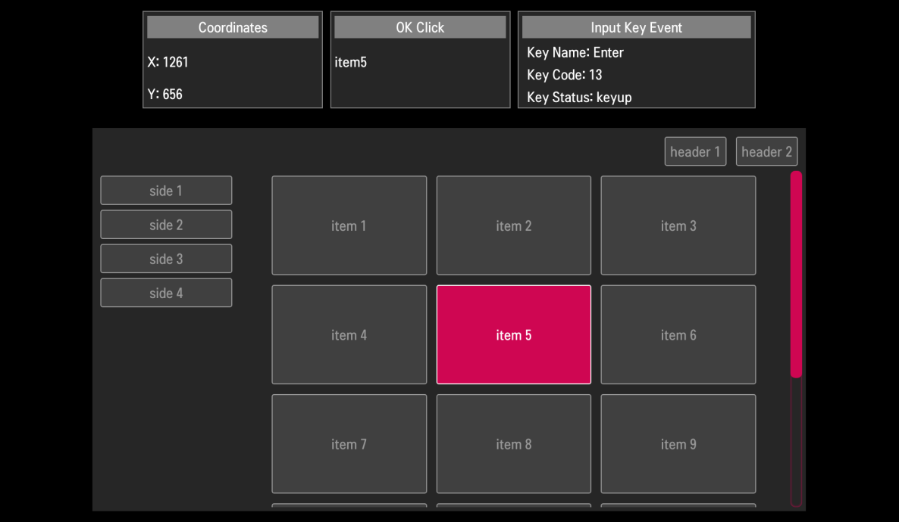

# Magic Remote Control

This sample app shows how to handle user inputs with the LG Magic Remote. For more information about LG Magic Remote,
see [Magic Remote](https://webostv.developer.lge.com/develop/guides/magic-remote/).

## Basic Magic Remote Control Behavior

The following list describes the basic processing principles for user inputs of LG Magic Remote.

- Selectable UI elements must be fully navigable by the screen cursor and 4-way navigation keys: Up, Down, Left, Right.

- A selection effect is mandatory to show what element is activated. The possible selection effects are animation,
  highlight, color, or size change, etc.

- One of the UI elements must be focused. This is a common mistake that developers make, so check the following:

  - When the cursor disappears from the screen by entering the navigation keys, the focus by the cursor must be
    changed to the focus by the navigation keys.

  - Contrary to the above, when the cursor is activated and is moving onto the UI element, the focus by the navigation
    keys must be changed to the focus by the cursor position.

- The page and list scroll can be appropriately controlled using the wheel of the Magic Remote.

For more information about UI guidelines,
see [UX Checklist](https://webostv.developer.lge.com/distribute/app-self-checklist#ux-self-check-guidelines).

## Adding Event Listeners

The `mouseover` event is fired when a pointing device (LG Magic Remote or mouse) is used to move the cursor onto an
element or one of its child elements. To handle the `mouseover` event, add the event listener to the document element.

## Result in the webOS TV

You can install the sample app and see the sample app result in the webOS TV as below image.

## Do's and Don'ts

- **Do** test this sample app on your webOS TV devices or webOS TV Simulator.

## Reference

To move focus between UI elements by 4-way navigation
keys, [spatial navigation](https://github.com/luke-chang/js-spatial-navigation) is used.
